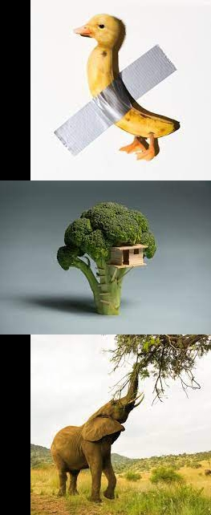

<h1 align="center">imagecat</h1>

<p align="center">Concatenate images into a single image on x or y axis with optional alignment centering</p>

<p align="center">
  <a aria-label="GoDoc" href="https://pkg.go.dev/github.com/dillonstreator/imagecat/v2">
    
  </a>
  <a aria-label="GoDoc" href="https://codecov.io/gh/dillonstreator/imagecat">
    
  </a>
  <a aria-label="GoReport" href="https://goreportcard.com/report/github.com/dillonstreator/imagecat/v2">
    
  </a>
  <a aria-label="GoReport" href="https://opensource.org/licenses/MIT">
    
  </a>
</p>

## Installation

```sh
go get github.com/dillonstreator/imagecat/v2
```

## Usage

```go
import (
    "image"

    "github.com/dillonstreator/imagecat/v2"
)

func main () {

    images := []image.Image{
        // ... images
    }

    // concat on x-axis with no alignment
    img, err := imagecat.Concat(images)
    if err != nil { /* handle error */ }

    // concat on y-axis with center alignment
    img, err = imagecat.Concat(images, imagecat.WithAxis(imagecat.AxisY), imagecat.WithAlignment(imagecat.AlignmentCenter))
    if err != nil { /* handle error */ }

}
```

## Examples

<div>
    <h3>Input images</h3>
    
    
    
    <h3>concat on x-axis with no alignment</h3>
    
    <h3>concat on x-axis with center alignment</h3>
    
    <h3>concat on x-axis with end alignment</h3>
    
    <h3>concat on y-axis with no alignment</h3>
    
    <h3>concat on y-axis with center alignment</h3>
    
    <h3>concat on y-axis with end alignment</h3>
    
</div>


